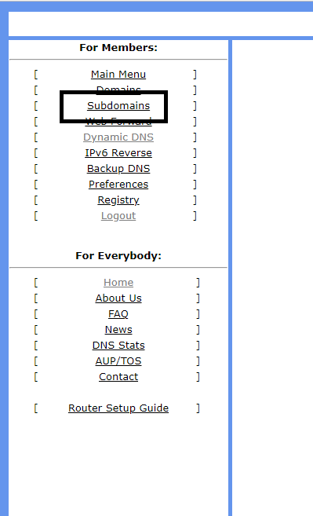

<!-- ---
documentclass: article
lang: pt-BR

title: Google Cloud Engine - Laboratório
subtitle: Criação de máquina para laboratório no Google Cloud Engine usando ansible e vagrant
author: Lucas Pimentel Lellis
--- -->

<!-- Descomentar bloco acima para gerar html com pandoc
     Ex.: pandoc --self-contained --css README.css -N --toc --highlight-style tango -f markdown README.md -t html5 -o README.html
 -->

# Pré-requisitos

* Sistema Operacional suportado pelo Ansible (Linux ou Mac OS - no documento é usado o Ubuntu 20.04 via Windows Subsystem for Linux - WSL)
* Conta no Google Cloud e projeto criado no Compute Engine - <https://console.cloud.google.com>
* Conta no FreeDNS - <https://freedns.afraid.org/> - Opcional

# Google Cloud SDK

## Instalação

  ```bash
  sudo apt-get install apt-transport-https ca-certificates gnupg
  echo "deb [signed-by=/usr/share/keyrings/cloud.google.gpg] https://packages.cloud.google.com/apt cloud-sdk main" | sudo tee -a /etc/apt/sources.list.d/google-cloud-sdk.list
  curl https://packages.cloud.google.com/apt/doc/apt-key.gpg | sudo apt-key --keyring /usr/share/keyrings/cloud.google.gpg add -

  sudo apt-get update && sudo apt-get install google-cloud-sdk git
  ```

## Configuração

  ```bash
  gcloud init
  ```

## Adicionar chave privada ao projeto

  ```bash
  # Caso não tenha uma chave já criada
  ssh-keygen -t rsa

  # Criar arquivo com as chaves já existentes
  gcloud compute project-info describe | grep ssh-rsa > ~/google-cloud-ssh.txt

  # Editar o arquivo e incluir no fim a chave desejada
  echo `whoami`':'`cat ~/.ssh/id_rsa.pub` >> ~/google-cloud-ssh.txt

  # Importar o arquivo criado
  gcloud compute project-info add-metadata --metadata-from-file ssh-keys="${HOME}/google-cloud-ssh.txt"
  ```

# FreeDNS (Opcional)

* Após criar uma conta no FreeDNS, ir na seção Subdomais (menu à esquerda)

  

* Clicar em Add a Subdomain

  

* Criar um registro do tipo A

  

* Voltar ao menu da esquerda e clicar em Dynamic DNS

  

* Clicar com o botão direito em Direct Link e Copiar o Link

  

* Inserir o link copiado na variável freedns_link do arquivo vars.yml


# Ansible

## Instalação

  ```bash
  sudo apt install software-properties-common
  sudo apt update
  sudo add-apt-repository ppa:ansible/ansible
  sudo apt update
  sudo apt install -y ansible python3-requests python3-google-auth openssh-client
  ```

## Criar conta de serviço no Google Cloud Engine

* Menu Principal -> IAM & Admin -> Service Accounts

  

* Create Service Account

  

* Criar a conta de acordo com as imagens abaixo

  

  

  

* Clicar na conta criada e ir em Keys -> Add Key -> Create New Key

  

  

  

* O arquivo .json deve ser baixado e armazenado em local seguro

## Configuração

### Preparar vim para arquivos YAML

  ```bash
  cat > ~/.vimrc <<'ENDEND'

  filetype indent off
  set tabstop=2 shiftwidth=2 expandtab
  set cursorcolumn cursorline

  ENDEND
  ```

### Clonar repositório Git

  ```bash
  # Criar pasta do projeto

  cd ~
  git clone https://github.com/lucaslellis/gcp_laboratorio_kvm.git
  ```

### Preencher arquivos de variáveis (consultar arquivos de exemplo disponíveis na pasta)

  ```bash
  cd ~/gcp_laboratorio_kvm

  cp inventory.gcp.yml.template inventory.gcp.yml
  cp vars.yml.template vars.yml

  vi inventory.gcp.yml

  vi vars.yml
  ```

### Verificar configurações

  ```bash
  # Verificar que o arquivo de configuração correto está sendo usado:

  ansible --version | grep config

  # Exemplo:
  lucas@<...>:~/gcp_laboratorio_kvm$ ansible --version | grep config
  config file = /home/lucas/gcp_laboratorio_kvm/ansible.cfg
  configured module search path = ['/home/lucas/.ansible/plugins/modules', '/usr/share/ansible/plugins/modules']
  lucas@<...>:~/gcp_laboratorio_kvm$ ansible --version | grep 'config file'
    config file = /home/lucas/gcp_laboratorio_kvm/ansible.cfg
  lucas@<...>:~/gcp_laboratorio_kvm$ ansible-config dump --changed-only
  INVENTORY_ENABLED(/home/lucas/gcp_laboratorio_kvm/ansible.cfg) = ['gcp_compute']
  ```

  ```bash
  # Verificar inventário (a senha solicitada será a mesma definida na criptografia):
   
  ansible-inventory --ask-vault-pass inventory.gcp.yml --list
  ```

# Criação da máquina  para o KVM

  ```bash
  ansible-playbook --ask-vault-pass -i inventory.gcp.yml vm01.yml
  ```

# Conectar na máquina criada

  ```bash
  gcloud compute ssh vm01 -- -L5901:localhost:5901
  ```

A opção `"-- -L5901:localhost:5901"` faz o [tunelamento da porta do VNC.](https://www.linkedin.com/pulse/ssh-3-formas-de-tunelamento-portas-que-voc%C3%AA-deveria-conhecer-ferraz)

# Definir senha do VNC e iniciar serviço

  ```bash
  vncpasswd

  sudo systemctl start vncserver@:1.service
  ```

# Conectar no VNC para validar configuração

  

  Resultado esperado:

  

  Caso apareçam pop-ups de warning ou erro "XFCE Policy Kit", favor ignorar.

# Validar instalação do Vagrant

  ```bash
  cd ~/vagrant/linux00
  vagrant up

  # Aguardar subida da máquina

  vagrant ssh
  ```

# Comandos para ligar e desligar a máquina

  ```bash
  # Desligar
  gcloud compute instances stop vm01

  # Ligar
  gcloud compute instances start vm01

  # Colocar para hibernar
  gcloud compute instances suspend vm01

  # Ligar novamente a partir da hibernacao
  gcloud compute instances resume vm01
  ```

# Destruir recursos criados (caso não vá mais usar)

  ```bash
  ansible-playbook --ask-vault-pass -i inventory.gcp.yml vm01-destroy.yml
  ```